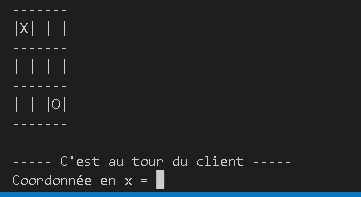
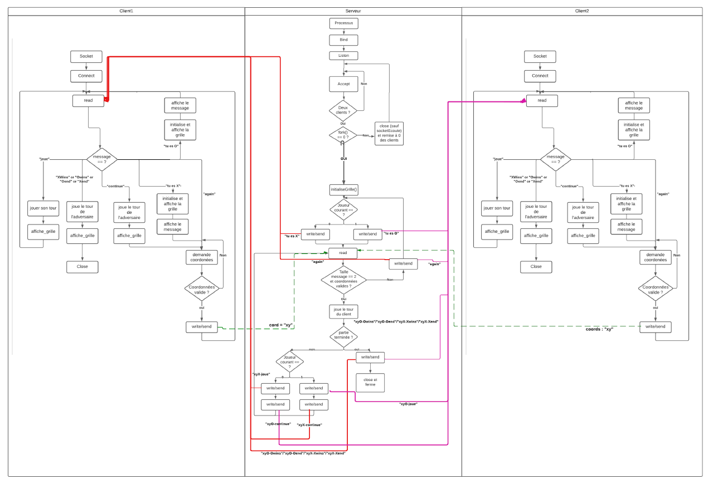

# **Morpion en ligne**

> Auteur : CZARKOWSKI Matthieu   - HAFFNER Aurélian
		   
## **Le projet 📢**

Le projet a pour but de réaliser le jeu du morpion en C en utilisant la communication entre plusieurs clients sur un serveur via les sockets et donc de créer plusieurs parties de morpion en 1v1.

Le serveur et deux clients se communiquent mutuellement les coups joués + respect des règles du jeu avec ajouts d'une fin, du gagnant | perdant.

En utilisant les forks il y a la possibilité de faire plusieurs parties.





## **Les prérequis 📍**

### Langage 📙

Ce projet tourne sous c,je vous conseille d'installer gcc pour les machines unix ou bien mingw pour les machines windows

## **Comment utiliser l'application ❓**

Tout d'abord télécharger ou forker le projet au complet pour avoir l'ensemble des fichiers et avoir qt design studio avec la bibliothéque graphique Qt.

### Lancer le programme ▶️

> #### 1. Avec le shell 👨‍💻

```
gcc T3N_serveur_V4.c -o serveur
gcc T3N_client_V4.c -o client
```
```
./serveur
```

Ouvrez deux autres terminaux et tapez dans chacun : PORT = 5000 par défaut, Valeur dans le fichier serveur (peut être modifier manuellement si bug
```
./client 127.0.0.1 PORT 
```
